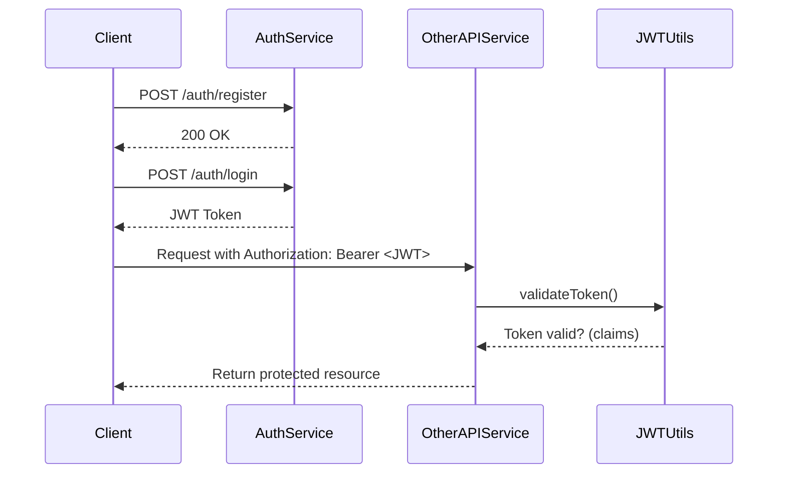

# AuthService

**AuthService** is a Spring Boot microservice that handles **user registration and authentication**. It issues **JWT tokens** for authenticated users, which can be consumed by other microservices (like DocuVault API) to secure endpoints.

---

## Table of Contents

1. [Features](#features)  
2. [Tech Stack](#tech-stack)  
3. [Setup & Running](#setup--running)  
4. [Environment Variables](#environment-variables)  
5. [API Endpoints](#api-endpoints)  
    - [Register](#register)  
    - [Login](#login)  
6. [JWT Flow](#jwt-flow)  
7. [Password Security](#password-security)  
8. [Future Extensions](#future-extensions)  

---

## Features

- **User Registration**: Create new users with unique username and email.  
- **Login**: Authenticate users and issue JWT tokens.  
- **JWT-based authentication**: Secure other microservices using issued tokens.  
- **Secure password hashing**: Uses `BCryptPasswordEncoder` from Spring Security.  
- **Spring Security integration** for authentication, password encoding, and optional roles.  

---

## Tech Stack

- **Java 17**  
- **Spring Boot 3**  
- **Spring Security**  
- **PostgreSQL** (Dockerized)  
- **JWT** (`io.jsonwebtoken`)  
- **Docker & Docker Compose** for containerized development  

---

## Setup & Running

**Prerequisites**

Docker Desktop should be installed on your machine and Docker Engine should be actively running.

1. **Clone the repository**

```bash
git clone https://github.com/jack-fajardo/auth-service.git
cd authservice
```

2. **Run with Docker Compose**

```bash
docker-compose up --build
``` 

This will spin up:

- AuthService on `http://localhost:8081`
- PostgreSQL database on port `5433`

3. **Dev Workflow**

- Hot reload is enabled. Changes in `src/` will auto-restart the service.  
- Dependencies are cached — no repeated downloads on rebuilds.  

---

## API Endpoints

### Register

**POST** `/auth/register`

Registers a new user with username, email, and password.

**Request Body (JSON)**:

```json
{
  "username": "john_doe",
  "email": "john@example.com",
  "passwordHash": "mypassword123"
}
```

**Response (200 OK)**:

```json
"User registered with id: 1"
```

**Behavior:**

- Validates **unique username** and **email**.  
- Hashes the password using BCrypt before saving.  
- Stores user in `app_user` table in PostgreSQL.  

---

### Login

**POST** `/auth/login`

Authenticates an existing user and issues a JWT token.

**Request Body (JSON)**:

```json
{
  "username": "john_doe",
  "password": "mypassword123"
}
```

**Response (200 OK)**:

```json
{
  "token": "eyJhbGciOiJIUzI1NiIsInR5cCI6IkpXVCJ9..."
}
```

**Flow:**

1. **Fetch user by username**  
2. **Verify password** using BCryptPasswordEncoder  
3. **Generate JWT token** with:  
   - Subject = username  
   - Expiration = 1 hour (default)  
4. Return JWT in `LoginResponse`  

---

## JWT Flow



- **AuthService**: issues tokens only.  
- **DocuVault API**: consumes token, validates it locally (manual JWT parsing).  

---

## Password Security

- Passwords are **never stored in plaintext**.  
- Uses `BCryptPasswordEncoder` from Spring Security.  
- Automatically salts passwords and provides secure hashing.  

---

## Future Extensions

- **Roles & Permissions**: add `ROLE_ADMIN`, `ROLE_USER` etc.  
- **Refresh Tokens**: implement JWT refresh flow.  
- **Token revocation / logout**: optional endpoint to invalidate tokens.  
- **OAuth / Social Login**: integrate Google, GitHub logins.  
- **Rate Limiting**: protect `/login` endpoint against brute-force attacks.  

---

This README is designed to:

- Explain **all endpoints clearly**  
- Describe **JWT flow** for other microservices  
- Provide **setup instructions** for Dockerized dev workflow  
- Be useful for both **frontend and backend developers**